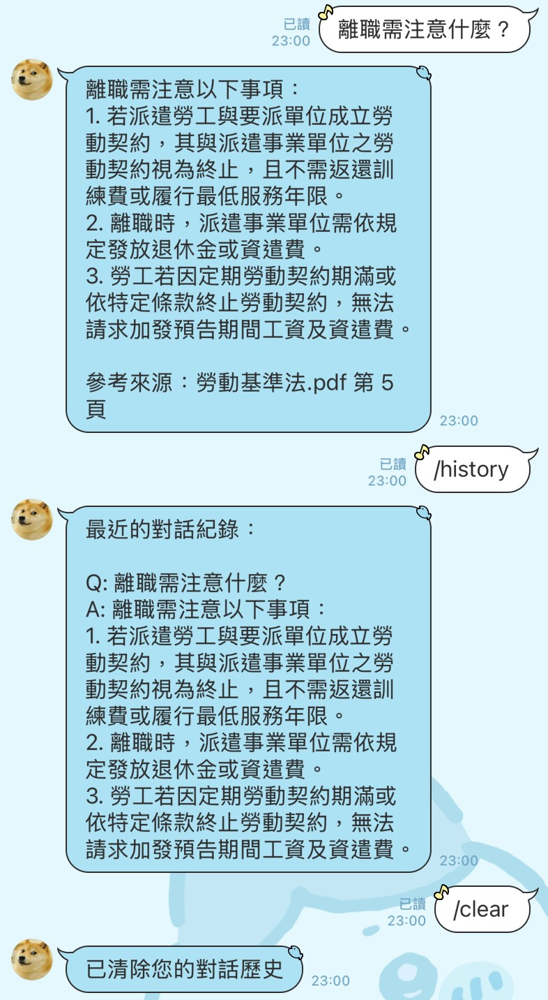

<!-- About the Project -->
## Project

This project use the following technologies to build a **Retrieval-Augmented Generation (RAG)** chatbot :

- **LangChain** : Handles retrieval, prompts, and QA chain

- **Qdrant** : A vector database used to store and search document embeddings

- **Azure OpenAI** : Generates responses based on semantic context

- **LINE Bot** : Enables user interaction by messaging

- **ngrok** : webhook exposure (note : ngrok is convenient for development but not recommended for production use)

- **Docker** : Manages the following components as services to ensure reproducible and simple deployment
  - Qdrant vector DB
  - PDF loader
  - ngrok tunnel
  - LINE chatbot

<!-- Installation -->
## Installation

Copy the repository
```sh
git clone https://github.com/Tingchiachi/RAG-PDF-Bot.git
cd RAG-PDF-Bot
```
Create a `.env` file:
```sh
LINE_CHANNEL_ACCESS_TOKEN=...
LINE_CHANNEL_SECRET=...
AZURE_OPENAI_ENDPOINT=...
AZURE_OPENAI_DEPLOYMENT_NAME=...
AZURE_OPENAI_API_VERSION=...
AZURE_OPENAI_KEY=...
AZURE_OPENAI_Embedding_ENDPOINT=...
AZURE_OPENAI_Embedding_DEPLOYMENT_NAME=...
AZURE_OPENAI_Embedding_API_VERSION=...
AZURE_OPENAI_Embedding_KEY=...
NGROK_AUTHTOKEN=...
```

<!-- Start -->
## Start

1. PDF documents should be placed in the `pdf document/` directory. They will be automatically vectorized on Qdrant.
   
2. Run the service with Docker Compose:
(all Python packages are pre-installed in Docker)
```sh
docker compose up --build
```

3. You will see a public ngrok URL printed in the terminal:
```sh
Ngrok Public URL (for LINE Webhook): https://abcd1234.ngrok-free.app/callback
```

4. Paste this URL into your LINE Developer Console as the Webhook URL.

<!-- Usage -->
## Usage

Send a message to linebot, for example:


<!-- License -->
## License

This project is licensed under the MIT License.

<!-- References -->
## References

- *LangChain 奇幻旅程* book
- [LangChain Documentation](https://docs.langchain.com/)
- [Qdrant Vector Database](https://qdrant.tech/)
- [Azure OpenAI Service](https://learn.microsoft.com/azure/cognitive-services/openai/)
- [LINE Messaging API Python SDK](https://github.com/line/line-bot-sdk-python)
- [Ngrok Documentation](https://ngrok.com/docs)
- [Docker Getting Started Guide](https://docs.docker.com/get-started/)

<!-- Contact -->
## Contact

E-Mail: [ting60101@gmail.com](mailto:ting60101@gmail.com)

GitHub: [https://github.com/Tingchiachi](https://github.com/Tingchiachi)

Linkedin: [https://www.linkedin.com/in/chia-chi-ting-2a4212280/](https://www.linkedin.com/in/chia-chi-ting-2a4212280/)

